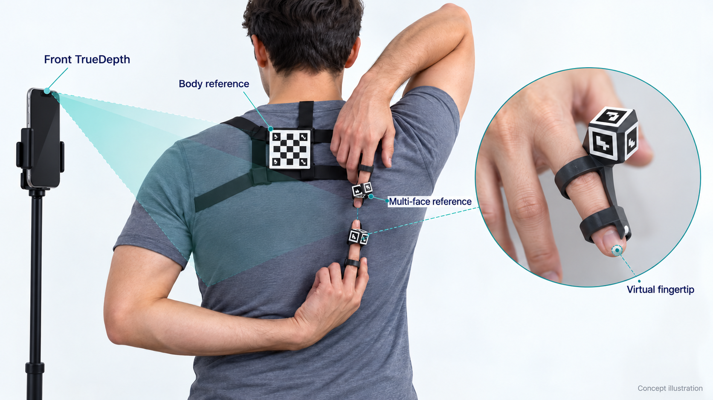
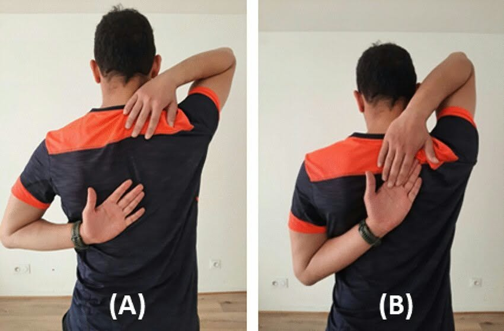
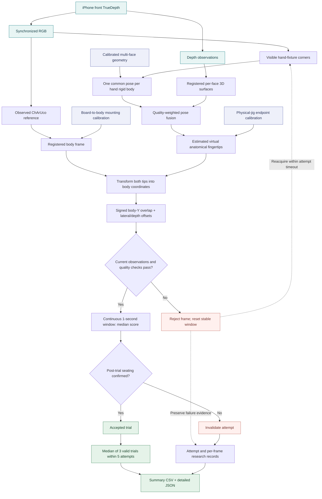

# ReachSenseAI

**Behind-the-back shoulder flexibility, measured in 3D.**

ReachSenseAI is a research measurement instrument in development that uses an iPhone's front TrueDepth camera and calibrated finger fixtures to estimate the gap or overlap between two middle fingertips during a behind-the-back shoulder flexibility test.

The design pairs each score with evidence about alignment, tracking, stability, and calibration—giving researchers a measurement they can inspect, repeat, and export.

> **Project status:** methodology and architecture are documented. The native iOS app, physical fixtures, and validation experiments are still to be developed. No final accuracy claim has been established.

*Concept illustration of the planned setup. Fixture shapes, marker patterns, and mounting are illustrative; final geometry and performance require experimental validation.*

## What it measures

The participant reaches one hand down from above the shoulder and the other up from below. ReachSenseAI estimates the anatomical middle-finger endpoints in a coordinate frame registered to the participant's back.

The primary score is **signed overlap along the body's upward axis**:

| Score | Meaning |
| --- | --- |
| Negative | A projected gap between the endpoints |
| Zero | Equal positions along the body axis |
| Positive | Projected overlap between the endpoints |

Sideways and depth offsets are recorded separately. Zero projected overlap does not establish physical contact, and fingers that appear aligned in an image may still be apart in depth.

## Designed for the difficult part of the test

### Fingertips can disappear without losing their reference

Overlap can hide one or both biological fingertips. Each fixture provides a calibrated virtual fingertip point, allowing its location to remain estimable while enough of the rigid reference is observed. If the reference becomes unobservable, the frame is rejected; a predicted point cannot silently become a valid measurement.

### Several faces contribute to one pose

Each finger fixture carries at least three uniquely identified markers on differently oriented faces. All usable visible corners contribute to one common 6-DoF rigid-body pose. Alternative faces provide observations during rotation and partial occlusion, with acceptance based on geometry, pose conditioning, residuals, and depth support rather than marker count alone.

### Depth adds a geometric check

Synchronized RGB and TrueDepth observations constrain the same known fixture geometry. Image corners, local depth surfaces, and temporal evidence contribute through quality-weighted fusion. Sensor disagreement and poor alignment trigger quality checks before a score is accepted.

### The score follows the participant's frame

A ChArUco reference on a calibrated upper-back mount establishes the body coordinate frame. The measurement is designed to account for camera tilt and participant orientation within validated conditions, rather than depend on a pixel gap in the camera image.

### Anatomical registration is part of the instrument

The proposed dorsal finger fixtures use two separated registration regions and a gentle fingertip stop. Their endpoint relationship, remount repeatability, and effects on posture and comfort must be tested. The upper-back mount receives its own registration calibration and drift checks.

### Every result has a record

The planned research exports include successful and unsuccessful attempts, per-frame geometry, quality metrics, rejection reasons, device details, and calibration and threshold versions. Summary CSV and detailed JSON support analysis and investigation of how a result was obtained.

## Measurement workflow

1. The researcher assigns one hand-up position per participant and keeps it consistent across visits.
2. With the phone on a stand, the researcher verifies calibration, fixture assignments, mounting, and fingertip seating.
3. After a familiarization attempt, the researcher starts each scored attempt. The app is designed to capture the median score over **one continuous second of passing observations**.
4. The researcher confirms seating after capture. A fixture swap or movement invalidates the affected trial and requires correction before restarting.
5. Up to **five scored attempts** are allowed to obtain **three valid trials**. Their median becomes the session score; an incomplete set receives no session score.

The provisional acquisition timeout is 15 seconds. Rest is researcher-controlled, and inter-attempt intervals are logged. Optional RGB/depth recording requires participant consent, uses local storage, and is retained indefinitely when enabled. Recorded media are included in exports only when explicitly selected.

## From observations to a score

Current observations are required for both hand rigid bodies and the body reference. Temporal prediction can assist tracking, but cannot supply a valid measurement. An incomplete three-trial set has no session score; its attempt records remain exportable.

The planned implementation uses native iOS sensor processing with Swift, OpenCV, and AVFoundation/ARKit as appropriate to verified device support. Core measurement does not depend on AI hand-landmark estimation or cloud processing.

## Validation before performance claims

The next development gate is **physical finger-fixture feasibility**, supported by minimal capture and detection tooling. Marker dimensions, mounting geometry, sensor support, and usable observation conditions will be established experimentally.

Bench validation covers known distances, hand and body rotation, depth offsets, partial and complete reference occlusion, pose observability, and palm-to-palm overlap. Provisional engineering targets are MAE ≤ 5 mm, absolute bias ≤ 2 mm, and repeated static measurement SD ≤ 2 mm. These are requirements to test, not demonstrated performance.

Scored human research follows bench acceptance. Human repeatability and equipment effects must then be assessed. Published reference categories require additional evidence that their test definition matches the instrument's projected-overlap score.

## Explore the project

| Document | Contents |
| --- | --- |
| [Measurement plan](plan.md) | Hardware, acquisition, geometry, QC, calibration, validation, and milestones |
| [Design decisions](docs/design-decisions.md) | Agreed protocol and architecture amendments |
| [Glossary](GLOSSARY.md) | Canonical measurement and instrument terminology |
| [Architecture decisions](docs/adr/) | Reasons behind consequential design choices |

Start with the measurement plan for the reproducible methodology. This repository does not yet contain a runnable iOS application.
