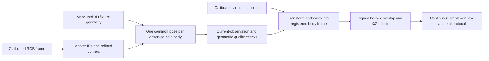

# ReachSense RGB web application

Status: approved and implemented as a research prototype. Branch: `develop/rgb-web`. Physical calibration, accuracy and phone performance remain validation gates.

## Intended outcome

Build a client-side application served by GitHub Pages. A single calibrated RGB camera observes known multi-marker 3D rigid fixtures. The app estimates one camera-relative 6-DoF pose for each physical fixture, transforms two calibrated virtual middle-fingertip endpoints into a participant-centered body frame, and reports their signed body-Y overlap in millimeters.

This is a separate RGB-only implementation of the existing measurement concept. Native TrueDepth acquisition is not a prerequisite for developing this branch. Depth-sensor fusion and depth-supported quality checks cannot be claimed by this implementation. Physical fixture calibration, anatomical seating and empirical measurement validation remain requirements for research results.

Keep the terminology in `GLOSSARY.md` and the endpoint, identity, assignment and protocol decisions in `docs/design-decisions.md`. This document changes the acquisition architecture for this branch; it does not silently replace the native methodology in `plan.md`.

## Recommended approach

Use static HTML/CSS and browser JavaScript, with a single pinned OpenCV.js runtime. Use its ArUco detector, calibrated projection and common-point PnP functions. A worker processes one current RGB frame at a time; discard obsolete queued frames rather than accumulate latency. The browser handles camera permission, configuration import, rendering, local persistence and exports. No server, account, cloud inference, framework or hand-landmark model is needed.

Alternatives considered:

- A JavaScript marker detector plus OpenCV.js PnP would require two libraries and a dictionary/corner-convention bridge. Keep it as a fallback only if the selected OpenCV.js artifact fails its runtime capability check.
- A custom OpenCV/WASM build could expose additional pose-solution APIs or reduce payload size, but adds a compiler/toolchain maintenance burden. Use it only if the pinned standard build cannot satisfy the required pose/ambiguity checks.

OpenCV 4.13's JS binding configuration lists ArUco detection, `solvePnP`, `solvePnPRansac`, `solvePnPRefineLM`, `Rodrigues` and `projectPoints`. Verify those actual browser APIs before choosing an artifact; source bindings alone do not prove runtime availability. Vendor the tested runtime and its license, record its version/digest, and serve it from the same Pages origin. Camera frames must never be sent to a third-party CDN or API.

## Body frame assumption for review

Use a third rigid marker reference on a repeatable upper-back mount, with known marker geometry and a calibrated reference-to-body transform. Positive body Y is superior along the torso, X is sideways, and Z is outward from the back. A visible reference does not prove correct anatomical mounting.

The initial supported reference, like the hand fixtures, must provide noncoplanar observed geometry that passes pose conditioning and ambiguity checks. An existing flat ChArUco board is not automatically interchangeable: supporting a planar reference requires a tested multi-solution disambiguation path. Until that exists, reject planar-only observations rather than substitute camera Y or a manually drawn image axis.

This assumption provides one common pose-estimation path for all three references. If the available body hardware is specifically a planar board, resolve that requirement before the implementation plan.

## Calibration contract

Import one versioned JSON bundle containing:

- Camera calibration ID/version, pinhole model, calibrated image width/height, matrix K, Brown-Conrady distortion coefficients, camera/lens identity and acquisition-mode/focus/zoom/orientation notes.
- A marker dictionary and globally unique marker IDs. Initially support the existing candidate `DICT_4X4_100`; use measured fixture files to choose final IDs and sizes.
- Two persistent physical finger-fixture IDs, calibration versions, measured canonical TL/TR/BR/BL marker corners in each common rigid frame, and the calibrated anatomical endpoint in that frame. Fixture millimeter geometry supplies metric scale.
- Body-reference identity/version, measured marker corners and a proper rigid transform mapping its reference coordinates into the anatomical body frame.
- Upper/lower assignments, selected hand-up position, and a versioned RGB-pipeline quality profile with validation provenance.

Validate finite numeric values, units, dimensions, positive focal lengths, supported coefficient counts/model, proper rotations, distinct IDs, nonzero/nondegenerate faces and endpoint/transform shape. Reject incompatible bundles with specific reasons. Missing camera/fixture/body registration prevents metric measurement. The checked-in CAD candidate is explicitly unmeasured; do not promote its nominal layout to verified calibration.

Bind calibration to the selected camera and acquired raw video dimensions. Processing resize may scale K by the known image transform, preserving the original calibration record. Do not silently accept changed camera modes, crop, zoom, focus or orientation. Stop measurement on camera/source changes and require setup reconfirmation; exposed track settings alone cannot certify unchanged optics.

Without a bench-validated quality profile, allow an explicitly exploratory geometry display/export but no accepted research trial or position session score. Record this distinction in exported data. TrueDepth-specific thresholds are not transferable to RGB by changing a label.

## Geometry pipeline



For each fixture, collect all current recognized corners belonging to it into one 3D-to-2D correspondence set. Solve a common pose using calibrated intrinsics/distortion, reject incompatible marker observations, and refine the accepted joint pose. Do not independently solve markers and average their translations or rotations. Reject duplicate IDs and insufficient or geometrically ambiguous correspondences.

Use column-vector transforms with explicit directions. Let `T_C_R` map a hand rigid frame R to camera C, `T_C_F` map the body-reference fixture F to camera C, and `T_B_F` map F to the registered body frame B:

```text
p_tip_C = T_C_R * p_tip_R
p_tip_B = T_B_F * inverse(T_C_F) * p_tip_C
delta_B = p_lower_B - p_upper_B
D = delta_B.y
```

Use millimeters for all object geometry, translations, endpoints and results. Camera coordinates are x-right, y-down, z-forward. Camera Y must not be used as body Y. Physical fixture IDs remain distinct from assigned upper/lower roles.

Display D as signed body-Y overlap: positive projected overlap, negative projected gap, zero equal body-Y coordinates. Report delta-X and delta-Z separately; optionally show Euclidean separation as a diagnostic. Zero D does not establish physical contact.

Biological fingertips may be hidden. Their virtual endpoints remain usable only while sufficient current observations of both hand fixtures and the body reference pass the checks. Do not enter temporally predicted or extrapolated endpoints into measurement windows.

## Quality and observability

Per fixture, preserve contributing marker IDs/corners, inliers/outliers, reprojection RMS/max residual, minimum edge/image area, visible face normals, pose conditioning, ambiguity evidence and positive camera-depth checks. Inspect the complete correspondence geometry; marker count alone is not an acceptance rule.

The supported V1 path requires noncoplanar geometry, positive camera depth, consistent reprojection, a well-conditioned pose, and no unresolved competing solution. A solver returning success is insufficient. Verify runtime solver behavior and use deterministic alternative initializations/solutions where needed to expose ambiguity. If the selected runtime cannot supply adequate evidence, reject the case or choose the custom-build alternative; do not claim an ambiguity test that was never evaluated.

RGB-estimated delta-Z is a model-derived alignment quantity, not an independent depth observation. Assess it against known bench geometry. Log motion, body-reference stability, alignment offsets, current frame timestamps, staleness and dropped processing observations. Derive and version limits through RGB-specific bench validation. Engineering preview limits may be provisional but must remain excluded from accepted research scores.

Reset continuity on any rejected/late/missing required observation. Stop on hidden pages, camera interruption, permission loss or worker failure; clear stale overlays/results. Require explicit restart. Serialize start/stop so a late permission response cannot restart stopped capture.

## Operator workflow

1. Import calibration/profile, select the RGB camera and confirm the camera mode, physical fixture identities, body mount and anatomical seating.
2. Enroll a local participant identifier and researcher-assigned hand-up position. Keep the position consistent across visits.
3. Record a familiarization attempt, separate from scored attempts.
4. The researcher confirms pre-trial seating and starts an attempt. Capture the median D across one continuous second of passing observations. A failed check restarts that window.
5. End unsuccessful acquisition after a provisional 15 seconds or researcher stop. Preserve the attempt and failure reasons. A captured window awaits the post-trial seating check; capture alone does not accept it.
6. Obtain three valid trials in at most five scored attempts. Preserve every attempt. Use the median of three accepted trials; fewer than three yields an incomplete position without a session score. Rest remains researcher-controlled and inter-attempt intervals are logged.
7. Observed within-session role swaps pause capture and invalidate the affected attempt. Require confirmed assignment/seating before restart. Calibration stays attached to physical fixture identity.

No bare-hand normative categories or accuracy claim belongs in the initial app. Maintain the jig-assisted research distinction.

## UI and data handling

Use one responsive operator page: setup/import and camera controls, raw-camera preview with marker/fixture/endpoint overlays, signed overlap and X/Z diagnostics, current quality/rejection explanation, attempt controls/seating checks, trial history and exports. Give screen-reader-readable status, labeled controls, keyboard operation and textual validity indicators in addition to color.

A valid numerical display must distinguish exploratory estimates, acquisition candidates, seating-pending captures and accepted trials. Clear the live numeric result when current observations fail; retain historical attempt results in the history.

Retain per-frame observations/geometry/quality/reasons/calibration IDs and all attempt outcomes locally in IndexedDB. Request persistent storage, surface write/quota failures, and require explicit JSON/CSV export for durable research retention. Browser storage can be evicted or cleared; it cannot promise indefinite retention. Indefinite retention is fulfilled by researcher-controlled exported files, with no automatic deletion in the app.

No RGB recording by default. Optional timestamped RGB frame retention requires explicit bench/participant consent selection; export those images only when separately selected. This application has no depth recording. If storage fails, stop the affected attempt rather than silently lose required research evidence.

Export summary CSV and detailed JSON with units/sign conventions, participant/position/roles, every attempt and validity result, stable-window membership, frame timing, geometry, quality/reasons, software version and calibration/profile versions. Optional RGB files must reference frame IDs. Downloaded artifacts remain on the researcher's device; no automatic uploads or analytics.

## Hosting and verification

Serve `web/` as a static GitHub Pages artifact built/tested from this development branch. Keep asset URLs relative to the project subpath. Configure Pages only after a passing application build and runtime smoke check; preserve the existing native workflows and source. Use HTTPS and explicit user camera permission. Show unsupported camera/runtime conditions clearly.

Required evidence before publishing the application increment:

- Browser runtime smoke checks for detection, PnP, refinement and projection APIs; dictionary artwork compatibility with the existing printed markers.
- Independent known-geometry projections recovering poses and metric virtual tips across camera/fixture/body rotations and distortion; signed-gap/overlap, X/Z and transform-direction tests.
- Rejection checks for planar/poorly conditioned observations, duplicate/missing IDs, behind-camera solutions, ambiguity, residual failures, occlusion, stale frames and missing/incompatible calibration.
- Protocol checks for continuous-window reset/median, timeout, seating rejection, swaps, three-in-five completion and incomplete sessions; persistence failure and export checks.
- Browser tests for camera permission/start/stop cancellation, worker failure/visibility handling, accessible controls and Pages subpath loading. Deterministic synthetic inputs prove software behavior only.
- A deployed Pages smoke check for static assets and application startup. Physical camera/browser support, fixture rigidity, anatomical registration, accuracy, repeatability and equipment effects remain open until real experiments supply evidence.

## Sources

- [OpenCV 4.13 JS binding configuration](https://github.com/opencv/opencv/blob/4.13.0/platforms/js/opencv_js.config.py).
- [OpenCV.js build documentation](https://docs.opencv.org/4.13.0/d4/da1/tutorial_js_setup.html).
- Existing project `GLOSSARY.md`, `docs/design-decisions.md`, ADRs 0002–0004 and the researcher protocol in `plan.md`.
