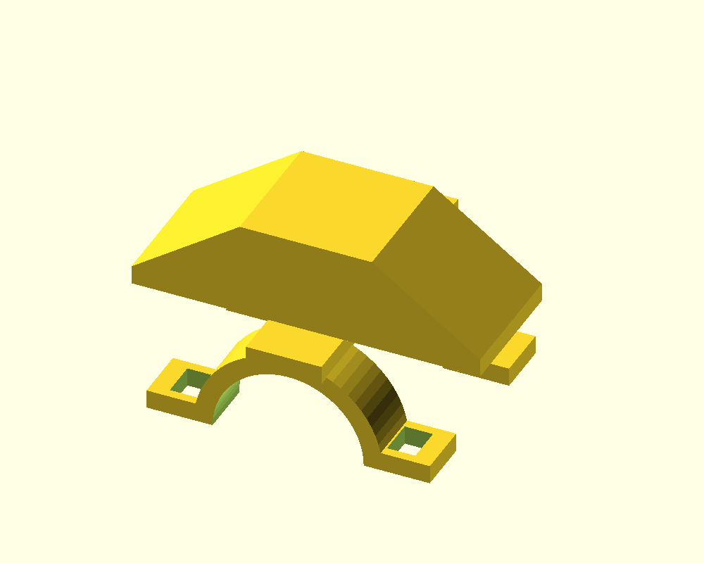

# Finger-fixture feasibility gate

The next physical gate is a repeatable anatomical relationship between each middle fingertip and its multi-face rigid reference. This directory supplies an adjustable CAD candidate and nominal geometry for experiments, not a validated or participant-ready fixture.

## Candidate design

`finger_fixture.scad` has two separated dorsal half-ring supports, retention slots, a bridge, a gentle fingertip stop, and a three-face marker mount. Candidate defaults are an 8 mm finger radius, 18 mm support spacing, 10 mm marker edges with 2 mm quiet-zone margins, and 35-degree side faces. These dimensions must be adjusted after fit, visibility, mass, comfort, and overlap tests. The mesh has no claim of joint immobilization or anatomical rigidity.

The physical frame R has origin at the nominal tip stop, +Y toward the distal fingertip, +Z dorsal, and +X lateral. Nominal face transforms and canonical corners come from the same dimensions. Actual prints, adhesive thickness, marker orientation, liner/strap choices, and fingertip registration require measurement and calibration.

```sh
python -m hardware.fixture_layout --output-dir hardware/generated/upper-candidate
python -m hardware.fixture_layout --radius-mm 9 --ids 31 32 33 \
  --output-dir hardware/generated/lower-candidate --openscad /path/to/openscad
```

Use OpenSCAD 2021.01 or newer to inspect/adjust the source and generate STL. Generated layout JSON is explicitly marked `candidate-unmeasured-not-valid-for-scoring`; it must not be passed off as verified jig calibration. Print the [candidate marker sheet](prototypes/marker-sheet.svg) at 100% and independently measure its black edges. [Marker generation/detection tools](../scripts/feasibility/README.md) support alternate experimental dimensions and dictionaries. Canonical marker tops must point toward fixture +Y for this nominal layout; verify actual mounting transforms.

## Required experiments before expanded fusion work

1. Measure actual finger/contact dimensions and select retention/liner materials. Document which middle/distal regions the supports register and which motions can alter the endpoint.
2. Independently measure virtual endpoint drift under insertion, finger flexion/rotation, sliding, repeated remounting, and palm-to-palm overlap. Separate mechanical movement from optical pose error.
3. Check hand/finger reach and comfort against the intended test; the stop/supports may change posture or prevent bare-finger contact. Record that equipment effect rather than assuming equivalence.
4. Test tag image area, corner geometry, blur, incidence angle, depth coverage, and occlusion at candidate camera distances. Establish usable observations from conditioning/residuals/depth support.
5. Measure every face transform and the anatomical endpoint in the common frame for each physical jig. Version the verified calibration and record jig identity, marker IDs/dictionary, marker orientation, geometry and verification evidence.
6. Prototype/calibrate a repeatable upper-back harness or multi-contact mount, including board-to-body registration and remount/angular drift.

Only demonstrated registration, visibility, and comfort evidence advances the physical gate. CAD rendering or passing software tests alone does not satisfy it.

## Rendered candidate



[STL mesh](prototypes/finger-fixture-candidate.stl) | [nominal face layout](prototypes/candidate-layout.json). Generated from the source with OpenSCAD 2021.01. The STL has 620 triangles, closed two-face edge topology, and nonzero volume. This is mesh evidence only; physical fit, seating rigidity and calibration remain untested.
