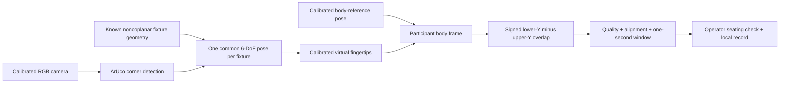

# ReachSense RGB Lab

Static browser research prototype on the `develop/rgb-web` branch. GitHub Pages serves it; a dedicated worker processes RGB camera frames locally using pinned OpenCV.js 4.13. No server image processing or TrueDepth access is involved.

Import a schema-1 JSON calibration bundle, enter the participant's anonymous study ID, choose the camera and confirm its lens/settings match calibration. Start the camera, check physical assignments and fingertip seating, then start each attempt. Confirm seating again after automatic capture. Three valid trials produce a position-specific median; five scored attempts without three valid trials leave the position incomplete. Familiarization is recorded separately. Stop or report changed assignments to invalidate and pause the affected attempt.

The supplied `examples/exploratory.json` demonstrates the format only. It is **not a camera or anatomical calibration** and cannot produce accepted trials. Actual camera intrinsics/distortion, metric face corners in detector corner order, anatomical fingertip offsets, fixture versions, body registration and bench-derived quality thresholds must be supplied by the researcher. Verified camera/fixture statuses, fixture evidence, body registration evidence and a validated threshold profile with evidence are required to enable research acceptance. These declarations are researcher-controlled; the software does not independently certify them.

Initial support requires three-dimensional, noncoplanar visible geometry for each hand fixture and the body reference. Planar-only observations are rejected. The solver checks joint reprojection residuals, normalized pose-Jacobian conditioning, positive camera depth and three LM starting points for competing poses. **This multistart check is not an exhaustive proof of unique pose.** Bench validation must establish supported visibility and conditioning limits. No predictions replace missing observations. ΔX and ΔZ are reported separately; zero projected Y does not imply contact.

Camera bindings include resolution and operator confirmation of lens, focus, zoom, crop and mounting. The browser cannot reliably lock or identify all optical settings on every device. Any incompatible setting or fixture/endpoint movement requires recalibration. Browser estimates lack independent depth evidence. Phone performance, physical accuracy, repeatability, equipment effects and compatibility with clinical norms remain unverified. The 10–15 processed fps objective is provisional. The live UI reports actual throughput, compute time and observation age.

IndexedDB retains sessions without automatic deletion, but browsers can evict storage. Export JSON for durable per-frame poses, quality, failures and full calibration records; CSV provides attempt summaries. Optional consented RGB snapshots are stored only for attempts when consent is selected before capture, with indefinite local retention; JSON includes them only when explicitly selected for export. No RGB video or depth recordings are implemented. Saved records remain available to exports after reload. A storage error stops capture and allows emergency export of the in-memory session.

## Checks and local preview

`npm ci`, `npm test`, `npx playwright install chromium`, `npm run browser-test` from this folder. Serve this folder through a local HTTP server, for example `python -m http.server 8080 --directory web` from the repository root. Camera access requires localhost or HTTPS. Assets use relative URLs for the GitHub Pages project subpath.

GitHub Actions runs the core and actual browser checks and publishes this folder from `develop/rgb-web`. The native instrument remains a separate architecture on the main branch.
